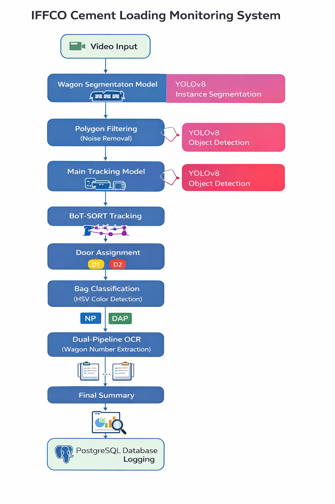

# 🚂 IFFCO Product Loading Monitoring System


An advanced industrial-grade computer vision pipeline designed to
monitor, count, classify, and log cement bags being loaded into railway
wagons using a **Dual-Model YOLOv8 architecture**.

------------------------------------------------------------------------

## 📌 Project Highlights

-   🟣 Dual-Model Detection + Segmentation Architecture
-   🚪 Dynamic Door-wise Bag Tracking
-   🎨 HSV-Based Real-Time Product Classification (NP vs DAP)
-   🔍 Competitive Dual-Pipeline OCR
-   🧠 BoT-SORT Multi-Object Tracking
-   🗄 Automated PostgreSQL Logging
-   🏭 Designed for Industrial Deployment

------------------------------------------------------------------------

## 🏗 System Architecture

### 🔷 High-Level Architecture Diagram

<p align="center">
  
</p>

------------------------------------------------------------------------

### 🔷 Processing Pipeline

    Video Input
        ↓
    Wagon Segmentation Model (YOLOv8 - Instance Segmentation)
        ↓
    Polygon Filtering (Noise Removal)
        ↓
    Main Tracking Model (YOLOv8 - Object Detection)
        ↓
    BoT-SORT Tracking
        ↓
    Door Assignment (D1 / D2)
        ↓
    Bag Classification (HSV Color Detection)
        ↓
    Dual-Pipeline OCR (Wagon Number Extraction)
        ↓
    Final Summary
        ↓
    PostgreSQL Database Logging

------------------------------------------------------------------------

## 🧠 Model Architecture

The system uses two custom YOLOv8 models working together.

---

### 1️⃣ Main Tracking Model — `best (3).pt`

**Detected Classes:**

- **0 → cement_bag**
- **1 → wagon_door**
- **2 → wagon_number**

**Responsibilities:**

- Detect cement bags
- Detect wagon doors
- Detect wagon number plates
- Provide tracking IDs for bag counting

---

### 2️⃣ Wagon Segmentation Model — `best (4).pt`

**Detected Classes:**

- **1 → wagon_body**

**Responsibilities:**

- Generate wagon boundary polygon
- Filter detections outside wagon
- Reduce background interference

------------------------------------------------------------------------

## 🔍 Core Features

### 🟣 Dual-Model Polygon Filtering

A segmentation model isolates the active wagon body. All detection and
OCR operations are restricted strictly inside this polygon.

### 🚪 Dynamic Door Assignment

-   Detects wagon doors automatically\
-   Sorts doors left → right\
-   Assigns `D1` and `D2`

### 🎨 Real-Time Product Classification (HSV Based)

  Product   Detection Logic
  --------- -------------------------
  🔵 NP     Blue threshold masking
  🟢 DAP    Green threshold masking

### 🔢 Smart Bag Counting

-   Uses persistent tracking IDs (BoT-SORT)
-   Each bag counted only once
-   Verified when bag center intersects door bounding box

### 🔍 Robust Dual-Pipeline OCR

Detail Pipeline: - Upscaling
- CLAHE enhancement

Morphology Pipeline: - Downscaling
- Gaussian blur
- Otsu inverse thresholding

### 🗄 Automated PostgreSQL Logging

Stores: - Date & Time
- Wagon Number
- Door counts
- NP/DAP breakdown
- Total bags

------------------------------------------------------------------------

## 📂 Project Structure

    IFFCO-Production/
    │
    ├── assets/
    │   └── architecture-diagram.png
    │
    ├── count_bags3.py
    ├── best (3).pt
    ├── best (4).pt
    ├── README.md
    └── requirements.txt

------------------------------------------------------------------------

## ⚙️ Installation

``` bash
pip install -r requirements.txt
```

------------------------------------------------------------------------

## 🚀 Usage

``` bash
python count_bags3.py
```

Press `q` to terminate the video window.

------------------------------------------------------------------------

## 👨‍💻 Author

**Shew Narayan Ray**\
Computer Vision & Industrial AI Systems

------------------------------------------------------------------------

## 📜 License

Intended for industrial and research use.
